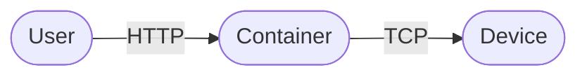

---
hide:
    - navigation
---
<!-- markdownlint-disable MD033 -->
# Switcher WebAPI Docs

```shell
docker run -d -p 8000:8000 --name switcher_webapi tomerfi/switcher_webapi:latest
```



<swagger-ui src="openapi.yml" oauth2RedirectUrl="#" supportedSubmitMethods="[]" validatorUrl="none"/>
